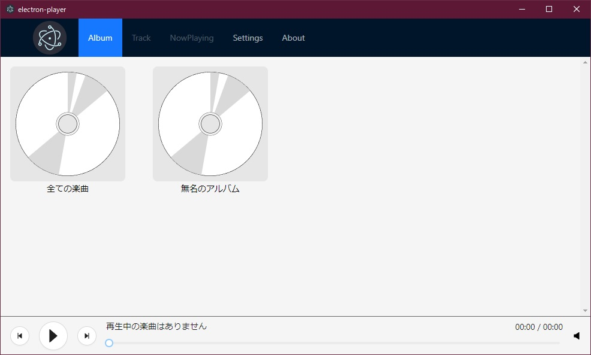

# Electron Player

Electronを利用した音楽プレイヤー

このアプリケーションは[Nextron](https://github.com/saltyshiomix/nextron)を用いて作成されています。

## 機能

-   [x] 音楽情報を閲覧する
-   [x] 音楽を再生する
-   [ ] 音楽情報を編集する
-   [ ] 音楽を取り込む

## ビルド

Windowsでは動作していますが、ビルドが正常に行えません。
Linuxではビルドも動作も可能です。ただし、Windows用バイナリの作成にはWineの導入が必要です。
Macでは一切動作を確認していません。動くかもしれませんし動かないかもしれません。
| OS | ビルド | 実行 |
| ------- | :----: | :---: |
| Windows | ✖ | 〇 |
| Linux | 〇 | 〇 |
| Mac | ? | ? |

```bash
$ yarn install
$ yarn build --win --linux
```

## スクリーンショット


